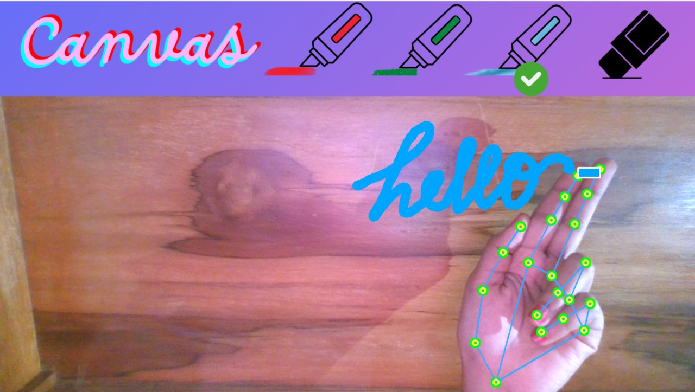

# Virtual-Canvas
## Overview
The Virtual Canvas allows users to draw in the air with their hands, using OpenCv and MediaPipe to capture movements and translate them into drawings on a digital canvas.

## Functionality

- OpenCV captures real-time video feed from the webcam, providing the necessary input for processing. Each captured frame is processed by MediaPipe to detect hand landmarks to 
   detect specific gestures. 
- You can draw by pointing with the index finger, and to select between markers, hold up both the index and the middle finger up.
- Based on the recognized gestures, it draws on the screen creating an interactive virtual canvas experience.

## Features

- **Drawing in Air:** Allows users to draw on a virtual canvas by moving their fingers in the air.
- **Color Selection:** Provides multiple coloured markers for drawing.
- **Clearing Canvas:** The eraser tool allows the user to clean specific parts of the canvas.

## Usage
- Install the required libraries using pip:
```bash
pip install opencv-python mediapipe numpy
```
- Clone the repository
- Run the main script:
```bash
python main.py
  ```
## Project Working


